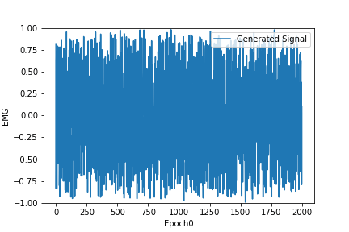
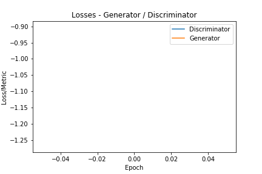
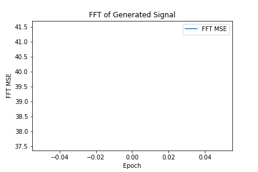
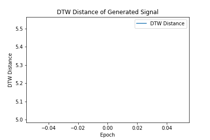
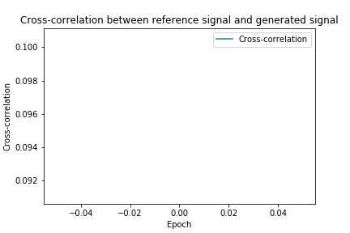

# What is EMG-GAN?
EMG-GAN is a custom implementation of a Deep Convolutional Generative Adversarial Network (DCGAN), focusing on generating synthetic electromyography (EMG) signals.

<b>See also:</b> [Keras-GAN](https://github.com/eriklindernoren/Keras-GAN/)

## Table of Contents
  * [Installation](#installation)
  * [Datasets](#datasets)

# Installation
We strongly recommend the usage of Anaconda for managing python environments. 
This set-up was tested under Windows 10, Ubuntu and Raspbian.
```
  $ conda create --name emg_gan python=3.6
	$ conda activate emg_gan
	$ git clone https://github.com/larocs/EMG-GAN
  $ cd EMG-GAN/
  $ pip install -r requirements.txt
	
```
	
# Usage
You can simply run the DCGAN pre-trained model already available inside ./saved_models to generate a batch of emg signals or you can train a new model based on your desired EMG signal.

The model is currently configured for receiving as input a 400-point window of floating-point values, and as output an EMG signal with 2,000 values.

You can change the configurations for the Generator and Discriminator on configuration.json file

Use one of the following, depending on your use case
```
python generate.py
python train.py

```

# Training Results
Some metrics are also available for evaluating the generated signal vs the reference signal. You can check below how the generator evolves over 5,000 epochs, and how is the Generator vs Discriminator losses and metrics.

## Results

<div align='center'>

</div>
<div align = 'center'>
<a href = 'figures/losses.gif'></a>
<a href = 'figures/fft.gif'></a>
<br>
<a href = 'figures/dtw.gif'></a>
<a href = 'figures/cross.gif'></a>
</div>

# Datasets
This work uses 2 datasets. One is a private dataset from Parkinson's Disease patients, and the other is NinaPro.
NinaPro is an open-source dataset that can be downloaded on: http://ninapro.hevs.ch/
Inside folder "data" you can find an extract from NinaPro DB2 already pre-processed for this work.

**NinaPro dataset source (DB2):**
```
@Article{atzori_data,
author={Atzori, Manfredo
and Gijsberts, Arjan
and Castellini, Claudio
and Caputo, Barbara
and Hager, Anne-Gabrielle Mittaz
and Elsig, Simone
and Giatsidis, Giorgio
and Bassetto, Franco
and M{\"u}ller, Henning},
title={Electromyography data for non-invasive naturally-controlled robotic hand prostheses},
journal={Scientific Data},
year={2014},
volume={1},
number={1},
pages={140053},
issn={2052-4463},
doi={10.1038/sdata.2014.53},
url={https://doi.org/10.1038/sdata.2014.53}
}
```
&nbsp;


# Paper
Paper under review. Will be soon available.

# Interested in contributing to EMG-GAN?
Thanks for the interest and please read the [Contributing](https://github.com/larocs/EMG-GAN/blob/master/CONTRIBUTING.md) recommendations.

# Authors
Esther Luna Colombini & Rafael Anicet Zanini

